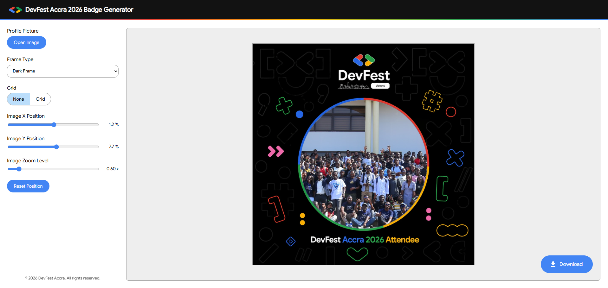

# DevFest Accra 2026 Badge Generator



> Generate your DevFest Accra 2026 profile badge directly in your browser. Select between Dark and Light frame styles, position and zoom your photo freely, and download in full resolution! No extra software required.

## Features

- 🌟 **Official DevFest Accra 2026 Frames**: Toggle between **Dark Frame** and **Light Frame** designs.
- 📏 **Composition Grid**: Toggle gridlines to align and frame your photo.
- 🔍 **Extended Zoom & Unrestricted Pan**: Zoom out to `0.1x` (up to `5.0x` zoom-in) and pan your image in any direction, no matter the photo size.
- 📂 **Drag and Drop**: Simply drag and drop your photo anywhere on the screen to load it.
- 📋 **Paste from Clipboard**: Copy any image and paste it directly onto the page.

## Local Setup

To run this project locally, ensure you have [Node.js](https://nodejs.org/) installed:

1. Clone the repository and navigate to the directory.
2. Install the dev dependencies:
   ```bash
   npm install
   ```
3. Start the Vite development server:
   ```bash
   npm run dev
   ```
4. Build for production:
   ```bash
   npm run build
   ```

## License

This project is published under the [MIT license](/LICENSE.md).

This project is a community-driven initiative and is not officially endorsed and/or supported by Google, the corporation.
